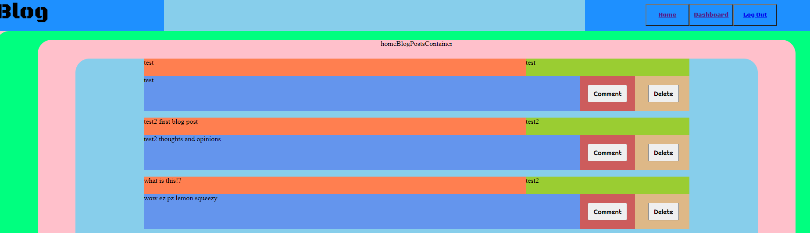

# Tech Blog

## Table of Contents

1.[Description](#Description) 
2.[Installation Instructions](#Installation-Instructions) 
3.[Usage Information](#Usage-Information) 
4.[Contribution Guidelines](#Contribution-Guidelines) 
5.[Test Instructions](#Test-Instructions) 
6.[License](#License) 
7.[Screenshots](#Screenshots) 
8.[Questions](#Questions) 
    ----> 1a.[GitHub User Name](#Github-User-Name) 
    ----> 2a.[Email](#Email) 
    ----> 3a.[Deployed Link](#Deployed-Link) 

## Description 

A template for creating a tech blog with functionality to create blog posts from unique user accounts and view a public board for all blog posts.

## Installation Instructions

You will be required to download and install packages node, mysql2, express, express-session, uuid and luxon.

## Usage Information

For those wanting to play around and learn how to make a blog for themselves to build upon or just for friends.

## Contribution Guidelines

This is a solo mission.

## Test Instructions

If you find any bugs go ahead and meet me at the corner of here and there and send smoke signals after rubbing two hurricane tall cans together and I will appear from a portal.

## License

MIT License
(https://opensource.org/licenses/MIT)

## Screenshots

## Questions

### Github User Name

algorithmnblues92@gmail.com

### Email

algorithmnblues92@gmail.com

 